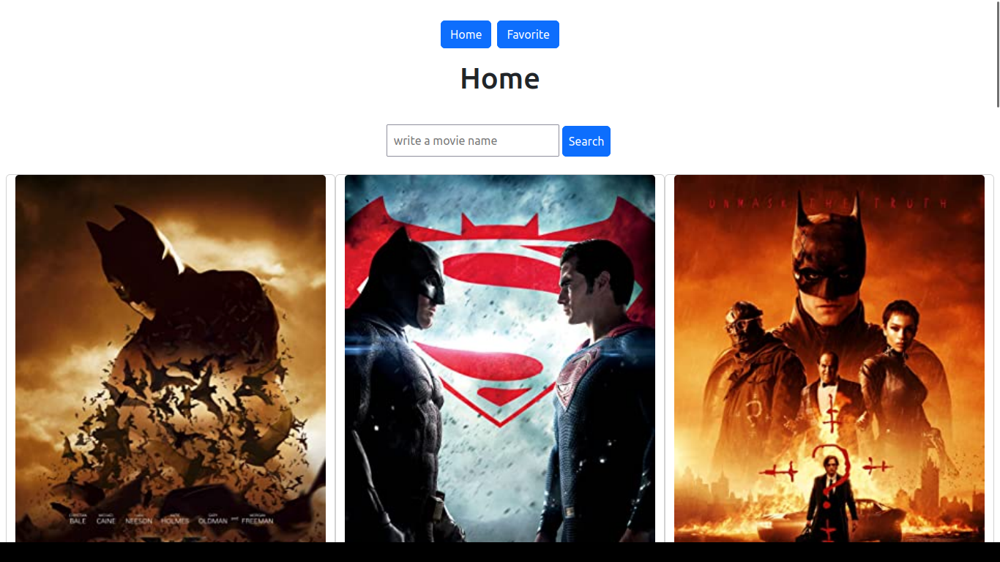

# Movies and TV shows

<h3 align="center">
  Home page preview  
  
  </h3>

 
<h5>I am using Free API Key on http://www.omdbapi.com/. Search for movies and TV shows.</h5>

## Working Senario
   <h5> when we come to first page there is a search box where we can put movie or Tv Shows name and we need to click on search and will get the reasult as we put the querry. after that we have "Add to " button with that we can add particuler movie in to our favorite list and we can see those movies or shows by clicking on "favorite"</h5>

# Blog_App_Frontend

## ⭐ Technologies that are used.

### FrontEnd
- #### React  
    This app is fully built on top of react library.
- #### Axios 
    Used for making api calls.
- #### BootStrap 5
    for css . 
- #### React-Toastify
    for showing Success alert on favourite added sucessfully 
    

## 🛠 Installation and Setup Instructions

1. Installation: `npm install`

2. In the project directory, you can run: `npm start`

Runs the app in the development mode.\
Open [http://localhost:3000](http://localhost:3000) to view it in the browser.
The page will reload if you make edits.

# Blog_App_Backend

## ⭐ Technologies that are used.
### Backend
-  Express
      - Backend is based on Express.Js
-   MySQL
      - for DB 

(we need to create a table into our MySql 

    - create table Favorites(id int auto_increment primary key, Title varchar(255), Year varchar(255), Type varchar(255),Poster varchar(255));
)

  
### Endpoint
- GET - http://localhost:5000/api/favorite
       - for geting the Favorite from Database
- POST - http://localhost:5000/api/favorite
       - for adding the Favorite information to Database 

## 🛠 Installation and Setup Instructions

1. Installation: `npm install`

2. In the project directory, you can run: `node server.js`
(use Nodemon insted Node if you want that changes will reload if you make edits.
(before using nodemon please ensure that nodemon is installed in your system))

##
<h4 align="center">Made with ❤️ from Anish</h4>
<h4 align="center">Thank You</h4>

